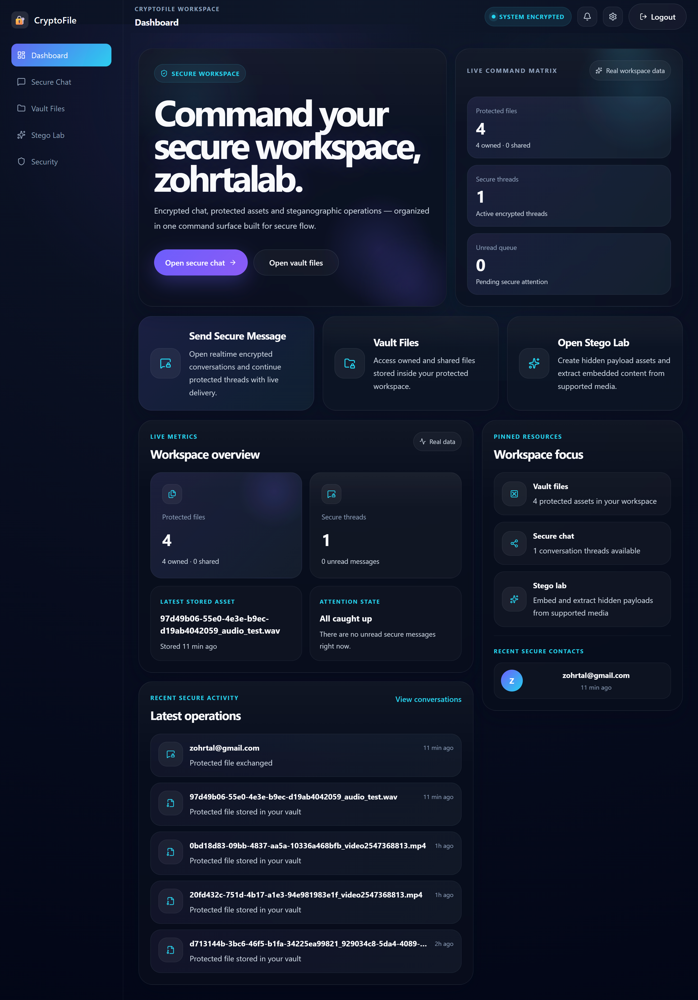

# 🔐 CryptoFile

**Secure Messaging & File Sharing with Steganography + Encryption**


CryptoFile is a full-stack cloud-based system for **secure communication and file sharing**, combining modern cryptography with advanced steganography techniques.

It allows users to **hide sensitive data inside media files** (images, audio, video) while protecting content with strong encryption.

---

## 🚀 Why CryptoFile?

Most systems focus only on encryption.  
CryptoFile goes further:

> 🕵️ Hide the existence of the message itself — not just its content.

This project demonstrates real-world:

- Cybersecurity concepts
- Secure system design
- Cryptography in practice

---

## ✨ Features

### 🔐 Authentication

- JWT-based authentication
- Password hashing with Argon2
- Password reset via email

### 💬 Messaging

- Real-time chat system
- Conversation-based structure
- Message status tracking

### 📁 File Sharing

- Upload and share files securely
- Ownership & access control
- Shared files visible in user vault

### 🕵️ Steganography

- Hide data inside:
  - 🖼️ Images
  - 🎧 Audio
  - 🎬 Video
- Extract hidden data
- Payload validation

### 🔒 Encryption

- AES-256-GCM encryption
- DEK per file/message
- KEK derived from user password
- Secure key wrapping

### ☁️ Cloud Storage

- Cloudflare R2 (S3-compatible)
- Persistent and scalable storage

---

## 🏗️ Architecture

Built using **Clean Architecture**:

```
presentation/   → FastAPI routes
application/    → use cases (business logic)
domain/         → core logic (pure)
infrastructure/ → database & external services
```

### Principles

- Separation of concerns
- Testable business logic
- No framework dependency in domain layer

---

## 🧰 Tech Stack

### Backend

- FastAPI
- SQLAlchemy
- PostgreSQL
- Alembic
- Docker
- JWT (python-jose)

### Frontend

- React
- TypeScript
- Vite

### Infra

- Cloudflare R2
- Render

### Security

- AES-256-GCM
- Argon2
- Key wrapping (KEK/DEK)

---

## 🎥 Live Demo

👉 https://cryptofile-fronted.onrender.com

---

## 🖥️ Run Locally

```bash
git clone https://github.com/ZoharTalAb/CryptoFile.git
cd CryptoFile/backend
cp .env.example .env
docker compose up --build
```

Backend:
http://localhost:8000

Docs:
http://localhost:8000/docs

---

## 🧪 Tests

```bash
PYTHONPATH=. pytest
```

---

## 📌 Notes

- Text steganography was removed due to reliability issues.
- The system focuses on media-based steganography.

---

## 👨‍💻 Authors

- Zohar Avramoviz
- Avishag Ariely
- Maya Melamed

All authors are Computer Science students at HIT (Holon Institute of Technology).

---

## 📄 License

Educational & portfolio project.
